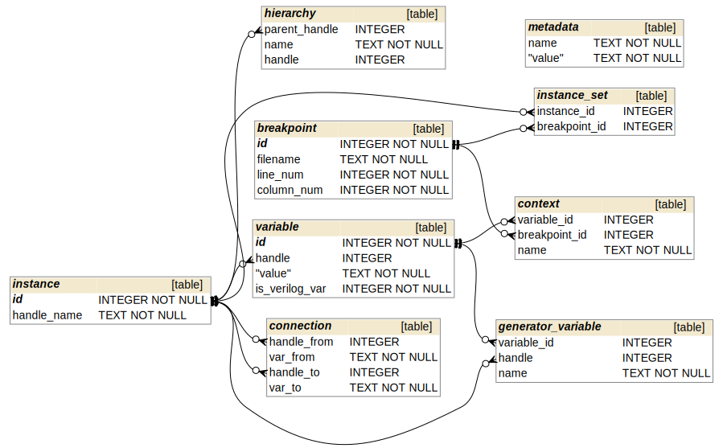

Kratos-Runtime Debug Database
=============================
This documentation describes the full design details of the `kratos-runtime` as
well as the capability of reference debugger implemented in Visual Studio Code.

## Database Format
Kratos-runtime uses `SQLite3` as storage format. This design choice is made due
to the fact that `SQLite3` is one of the most used database and doesn't depend
on a running service. There are hundreds of language drivers and visualization
frameworks to help users understand the database content.

### Database schema


Below is the raw SQL query that can be used to create each table
- `instance`
    ```SQL
    CREATE TABLE IF NOT EXISTS 'instance' ( 'id' INTEGER PRIMARY KEY NOT NULL , 'handle_name' TEXT NOT NULL );
    ```
- `hierarchy`
    ```SQL
    CREATE TABLE IF NOT EXISTS 'hierarchy' ( 'parent_handle' INTEGER , 'name' TEXT NOT NULL , 'handle' INTEGER , FOREIGN KEY( parent_handle ) REFERENCES instance ( id ) );
    ```
- `variable`
    ```SQL
    CREATE TABLE IF NOT EXISTS 'variable' ( 'id' INTEGER PRIMARY KEY NOT NULL , 'handle' INTEGER , 'value' TEXT NOT NULL , 'name' TEXT NOT NULL , 'is_var' INTEGER NOT NULL , 'is_context' INTEGER NOT NULL , FOREIGN KEY( handle ) REFERENCES instance ( id ) );
    ```
- `context`
    ```SQL
    CREATE TABLE IF NOT EXISTS 'context' ( 'variable_id' INTEGER , 'breakpoint_id' INTEGER , 'name' TEXT NOT NULL , FOREIGN KEY( variable_id ) REFERENCES variable ( id ) , FOREIGN KEY( breakpoint_id ) REFERENCES breakpoint ( id ) );
    ```
- `connection`
    ```SQL
    CREATE TABLE IF NOT EXISTS 'connection' ( 'handle_from' INTEGER , 'var_from' TEXT NOT NULL , 'handle_to' INTEGER , 'var_to' TEXT NOT NULL , FOREIGN KEY( handle_from ) REFERENCES instance ( id ) , FOREIGN KEY( handle_to ) REFERENCES instance ( id ) );
    ```
- `breakpoint`
    ```SQL
    CREATE TABLE IF NOT EXISTS 'breakpoint' ( 'id' INTEGER PRIMARY KEY NOT NULL , 'filename' TEXT NOT NULL , 'line_num' INTEGER NOT NULL );
    ```
- `metadata`
    ```SQL
    CREATE TABLE IF NOT EXISTS 'metadata' ( 'name' TEXT NOT NULL , 'value' TEXT NOT NULL );
    ```
- `instance_set`
    ```SQL
    CREATE TABLE IF NOT EXISTS 'instance_set' ( 'instance_id' INTEGER , 'breakpoint_id' INTEGER , FOREIGN KEY( instance_id ) REFERENCES instance ( id ) , FOREIGN KEY( breakpoint_id ) REFERENCES breakpoint ( id ) );
    ```

### Database Description
As you can see from the table schema, most of the tables have references to the
instance. The `handle_name` is the full path of an instance excluding the test bench
name, such as `TOP`. If your design is named `dut` inside `TOP`, then the top level
handle name is `dut`.

Each breakpoint has its unique id, which will be inserted into any statement you want
to have breakpoint on. The `filename` in breakpoint is absolute path to ensure the
support for remote debugging. `line_num` starts from `1`, as commonly used in text
editors.

Connection describes a directional edge. The from and to instance should refer to the
instance table.

Variable is the critical port of the database. It has its unique identifier and
attributes. If the variable is used as a verilog variable, `is_var` should set to
`1`. In that case, `value` is the full path of that variable in verilog. If it's
a python variable, `value` should be the value in string. `name` is the name of
the variable as appear in your hardware construction language. If the variable
doesn't have any name, `name` can be empty.

Context is a context variable such as `locals()` in Python. It has to refers to
a row in `variable` table. The `name` filed denotes the name that appear in your
hardware construction language.

## Variable Mapping to Kratos-Runtime
Every variable stored in the database has to be a scalar value. That means if you
have a complex type, such as packed struct or 2D array, you need to flatten the
variable hierarchy. If done in a particular way, the reference debugger can
reconstruct the variable hierarchy.

The flattening process involves adding `.` to the variable hierarchy. For instance,
image you have an object named `obj` defined as follows:
```
obj: {
    value1: port_1,
    value2: port_2
}
```
Where `port_1` and `port_2` correspond to the verilog value. You should store your
variable in the following format
```
name       | value
-------------------
obj.value1 | port_1
obj.value2 | port_2
```

The same rule applies to the verilog value. If you have an array that mapped
to an array in verilog:
```
array -> port_array
```
Since `port_array` is not a scalar, you have to flatten it as following
```
name      | value
-------------------------
array.0   | port_array[0]
array.1   | port_array[1]
```
If you have multiple hierarchy either in your own variable or in verilog variable
you can keep adding `.` to build up your hierarchy as long as the `value` is a valid
verilog handle name. The reference debugger will reconstruct the original variable
in the debugger.


### Context variables
Context variables refer to variables that exists in the local frame when a statement
is being executed. You can store any context variables in the `variable` table. You
should mark any variable used in context `is_context = 1`. The linking process
is done through `context` table. To allow more compacted
representation, you can refer to existing variables in the `variable` table using
the foreign key `variable_id`.

### Generator variables
Generator variables refers to variables that are associated with the instance itself.
Generally speaking it has two parts:
1. Variables defined inside the instance in your own DSL
2. Verilog variables defined in instance

For category 1, you need to nested everything inside a namespace such as
`self` in Python and `this` in C++. It follows the same hierarchy rule
mentioned above. For instance, if defined a class in Python such as
```Python
class Foo:
    def __init__(self):
        self.num = 1
```
`num` should be stored as `name = self.num; value = 1` in the database.

For category 2, since it doesn't have DSL-level correspondence, the `name`
filed must be empty.

All variables stored as generator variables has to have `is_context = 0`
in the database.

## Breakpoint Insertion
The breakpoint is implemented as a `DPI` function. In cases where your hardware
construction language can only generate Verilog-95 or Verilog-01, you have
to somehow manage to generate the following SystemVerilog syntax:
- ```
  import "DPI-C" function void breakpoint_trace(input int  stmt_id);
  ```
  You should put the `breakpoint_trace(id)` call above any statement you want to
  debug. Notice that the `id` correspond to the breakpoint id in the database.
  As a result, the filename and line number information has to match with
  whatever statement below the `DPI` call. You can only put breakpoint statement
  in the `always` block. For instance:
  ```SystemVerilog
  always_comb begin
     breakpoint_trace (32'h0);
     out = in - 1'h1;
  end
  ```

- ```
  import "DPI-C" function void breakpoint_clock();`
  ```
  You should put the `breakpoint_clock` on the negative edge at the top level
  and only once:
   ```SystemVerilog
   always_ff @(negedge clk) begin
       breakpoint_clock ();
   end
   ```
- ```
  import "DPI-C" function void exception(input int  stmt_id);`
  ```
  If your hardware construction supports language assertions, you should include this
  `DPI` import. The `stmt_id` should the the assertion statement id (not the one below).
  Here is an example how to use it in an assertion:
  ```SystemVerilog
  assert (out == in) else exception (32'h1);
  ```
  If the assertion fails, it will "throw" and exception to the debugger.

You can see the `tests/` folder to see more examples.
